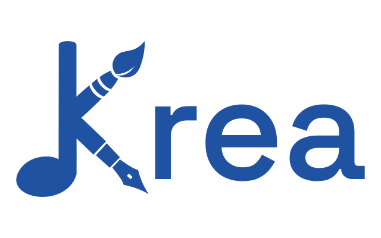

  <picture>
    
  </picture>
  <h4>A Unified, Decentralized Haven for the Polymath Artist</h4>

*Krea* is a next-generation social media platform and creative hub built for the **Fediverse**. It is designed to be a cohesive, warm, and artist-centric space where musicians, writers, and visual artists can thrive without the constraints of centralized silos. 

In the current digital landscape, artists are often forced to fragment their identity: a profile for music, a gallery for art, and a blog for writing. *Krea* dissolves these barriers, allowing creators to host their entire portfolio in a single, fully federated home powered by the **ActivityPub** protocol.

## Three Worlds, One Profile

We believe that creativity isn't linear. Our platform bridges the gap between different mediums by providing dedicated tools for three main artistic pillars:

* **The Studio (Sound):** A home for musicians and podcasters. Think high-quality audio streaming, album collections, and discographies—bringing the spirit of **Bandcamp** to the decentralized web.
* **The Library (Word):** A space for novelists, poets, and essayists. With long-form reading experiences and episodic publishing reminiscent of **Wattpad**, writers can finally engage with a federated audience.
* **The Gallery (Visual):** A high-fidelity showcase for digital artists, photographers, and illustrators. Inspired by the community-driven curation of **DeviantArt**, the Gallery focuses on presentation and discovery.

## Key Features

* **Unified Creative Identity:** One profile to rule them all. Publish a song, a short story, and a painting in a single, beautiful timeline.
* **Federated Engagement:** Built on **ActivityPub**, your work is discoverable across the entire Fediverse (Mastodon, Pleroma, PixelFed, etc.) while maintaining the unique features of our platform.
* **Artist Empowerment:** Built-in support for commissions, tips, and donations. We believe artists should be compensated for their labor without predatory platform fees.
* **A Warm Environment:** Designed from the ground up to be a supportive "third place." Our moderation tools and community guidelines are built to foster encouragement and genuine connection.

## Built With

The project is currently a **Work in Progress (WIP)**, utilizing a modern, performant, and type-safe stack:
* **Backend:** Developed with **Deno** and **TypeScript** for a secure and modern runtime.
* **Federation:** Powered by the **[Fedikit](https://github.com/fedikit/fedikit)** library, ensuring deep and reliable integration with the ActivityPub ecosystem.
* **Frontend:** A responsive, fluid interface built with **React**.

---

> **Note:** This project is in its early stages of development. We are currently laying the groundwork for a more open, artistic, and decentralized future. Stay tuned as we build this home, one stone at a time.
